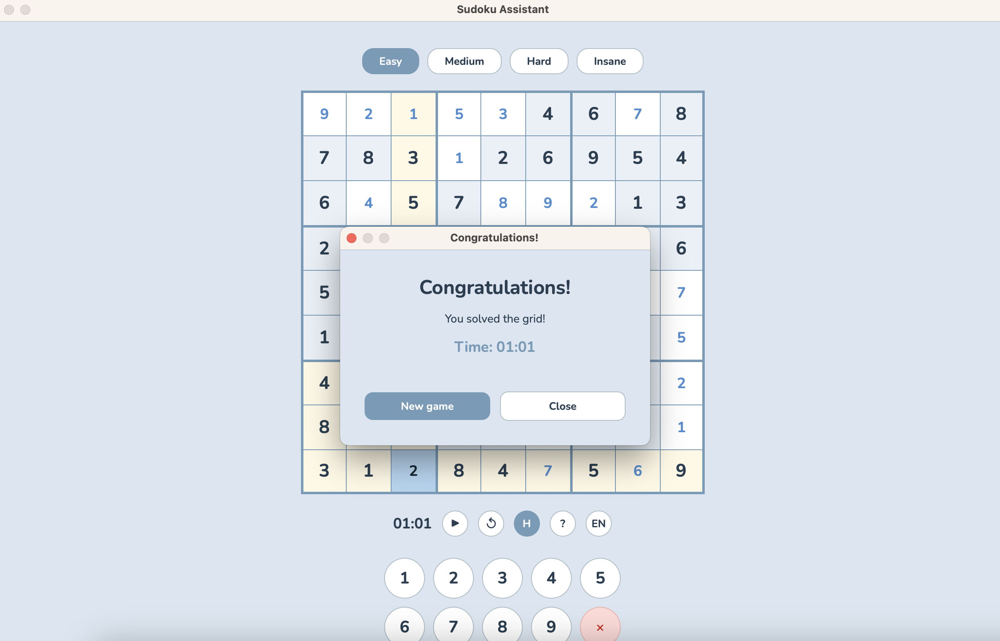
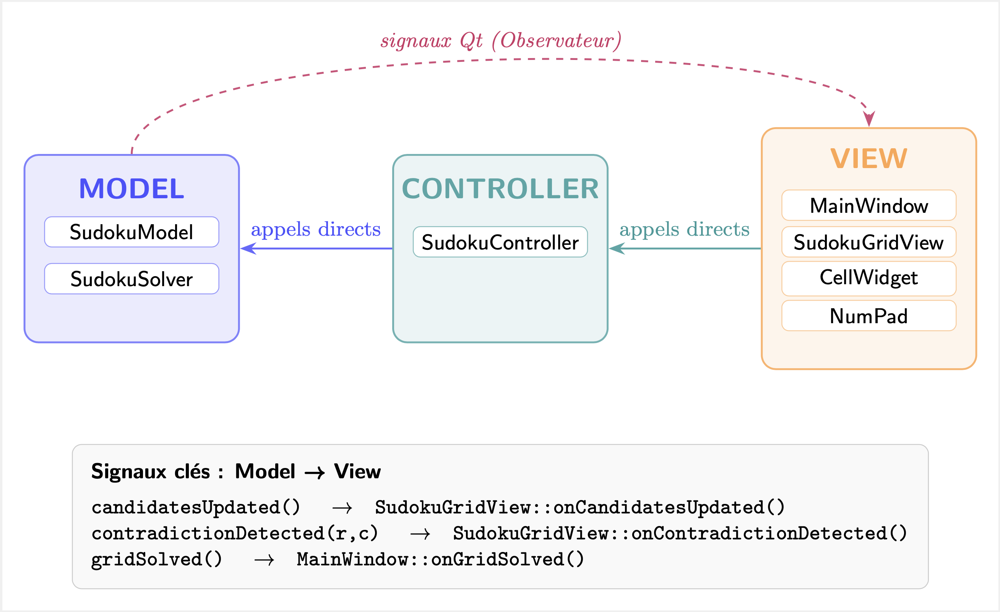

# Sudoku Assistant

Application d'assistance au Sudoku développée en C++17 avec le framework Qt6, suivant le patron architectural MVC (Modèle-Vue-Contrôleur). Elle offre une interface graphique complète permettant de jouer, d'analyser et de résoudre des grilles de Sudoku avec des aides visuelles en temps réel, un chronomètre, un système d'annulation, et un support bilingue français/anglais.

---

## Demo

https://github.com/user-attachments/assets/db8e208a-4faf-4f73-9cde-45ee323951b3

<p align="center">
  
</p>

---

## Fonctionnalités

### Gestion des grilles

- **Chargement par difficulté** : quatre niveaux disponibles (Facile, Moyen, Difficile, Insane), chacun associé à un fichier de grilles embarqué dans les ressources. Une grille est tirée aléatoirement dans le fichier correspondant à chaque nouvelle partie.
- **Chargement depuis un fichier** : ouverture de grilles personnalisées au format texte (`.txt`, `.sdk`) via le menu Fichier > Ouvrir grille ou le raccourci Ctrl+O. Une grille est tirée aléatoirement parmi celles contenues dans le fichier.
- **Réinitialisation** : le bouton de redémarrage (↺) recharge une nouvelle grille de la même difficulté et remet le chronomètre à zéro.

### Saisie et navigation

- **Sélection de cellule** : clic souris ou touches directionnelles. La cellule sélectionnée est mise en évidence en bleu, et toute la ligne, la colonne et le bloc 3x3 correspondants sont automatiquement surlignés en jaune pâle.
- **Saisie de valeurs** : chiffres 1 à 9 via le clavier ou le pavé numérique virtuel. Les cellules fixes (données initiales) sont protégées en écriture.
- **Effacement** : touche Suppr ou Retour arrière pour vider la cellule sélectionnée.
- **Désélection** : touche Échap pour désélectionner la cellule active et retirer le surlignage.

### Aides visuelles (indices)

- **Pencil marks** : lorsqu'une cellule vide est sélectionnée, les candidats possibles (valeurs non encore présentes dans la même ligne, colonne ou bloc) sont affichés en petits chiffres dans une grille 3x3 à l'intérieur de la cellule.
- **Détection des naked singles** : les cellules n'ayant qu'une seule valeur candidate possible sont mises en évidence en vert clair automatiquement, signalant au joueur une case facilement résolvable.
- **Détection des contradictions** : toute cellule dont la valeur entre en conflit avec une autre cellule sur la même ligne, colonne ou bloc est immédiatement colorée en rouge. Les cases vides sans aucun candidat valide sont également signalées.
- **Activation/désactivation des indices** : un bouton dédié "H" dans la barre du chronomètre (et son équivalent dans le menu Aide > Activer/désactiver les indices ou Ctrl+H) permet de masquer ou de restaurer instantanément les pencil marks et le surlignage des naked singles, sans affecter la détection des contradictions.

### Chronomètre et pause

- **Chronomètre** : un compteur MM:SS démarrant automatiquement au chargement de chaque nouvelle grille, affiché en permanence dans la barre sous la grille.
- **Pause** : le bouton ⏸ ou la touche Espace suspend le chronomètre et affiche un overlay semi-transparent masquant la grille, rendant le jeu invisible pour éviter les regards indésirables. Une pression supplémentaire reprend la partie.
- **Victoire** : à la résolution complète de la grille, le chronomètre s'arrête automatiquement et une boîte de dialogue de félicitations s'ouvre, affichant le temps total en MM:SS, avec les options Nouvelle partie (charge une nouvelle grille et ferme le dialogue) et Fermer.

### Annulation et rétablissement

- **Annulation** : Ctrl+Z annule la dernière saisie et restaure la valeur précédente de la cellule modifiée. L'historique couvre toutes les modifications effectuées depuis le chargement de la grille.
- **Rétablissement** : Ctrl+Y (ou Ctrl+Shift+Z selon la plateforme) rétablit la dernière action annulée.
- Les piles d'annulation et de rétablissement sont automatiquement effacées au chargement d'une nouvelle grille.

### Interface et ergonomie

- **Barre de difficulté** : quatre boutons à sélection exclusive (Facile, Moyen, Difficile, Insane) avec le niveau actif mis en évidence. Chaque bouton porte une infobulle descriptive.
- **Barre de contrôle (chronomètre)** : affiche le temps écoulé et regroupe les boutons ⏸ (pause), ↺ (redémarrer), H (indices), ? (aide) et FR/EN (langue).
- **Pavé numérique virtuel** : widget NumPad en bas de fenêtre permettant la saisie des chiffres 1 à 9 et l'effacement à la souris, avec infobulles.
- **Barre de menus** : menus Fichier, Édition, Aide, chacun avec actions, raccourcis clavier et séparateurs. Le menu Aide contient également le sous-menu Langue.
- **Barre d'état** : messages contextuels informant du résultat de chaque action (grille chargée, annulation effectuée, etc.).
- **Infobulles** : tous les éléments interactifs (boutons, actions de menu) disposent d'une infobulle descriptive au survol, avec fond blanc et texte sombre.
- **Police Nunito** : interface typographiée avec la police Nunito, embarquée directement dans les ressources Qt (`.qrc`) pour un rendu identique sur toutes les plateformes.
- **Guide du joueur** : accessible via F1, le bouton ? ou le menu Aide. Présente la légende des couleurs avec des échantillons visuels, et un tableau complet des raccourcis clavier.

### Internationalisation (FR / EN)

- L'application supporte le français et l'anglais sans redémarrage.
- Le changement de langue est accessible via le bouton FR/EN dans la barre de contrôle, ou via le menu Aide > Langue.
- La traduction repose sur le pipeline Qt : `lupdate` extrait les chaînes depuis les appels `tr()`, `Qt Linguist` permet de les traduire dans les fichiers `.ts`, et `lrelease` compile ces fichiers en `.qm` binaires embarqués dans les ressources.
- Le changement de langue en cours d'exécution est géré par `retranslateUi()`, qui met à jour tous les textes (menus, boutons, infobulles, barre d'état) sans reconstruire les widgets ni redémarrer l'application.

---

## Architecture

Le projet suit le patron **MVC (Modèle-Vue-Contrôleur)**. La Vue observe directement le Modèle via les signaux Qt (patron Observateur) et délègue les actions utilisateur au Contrôleur. Le Contrôleur met à jour le Modèle, qui notifie la Vue en émettant des signaux.

<p align="center">
  
</p>


### Modèle (`src/Model/`)

Encapsule l'état complet du jeu et la logique métier. Ne dépend d'aucun composant graphique.

#### `SudokuModel`

Cœur du Modèle. Maintient :

- La grille 9x9 (`m_grid[9][9]`) avec les valeurs entrées.
- Les marqueurs de cellules fixes (`m_fixed[9][9]`) pour protéger les valeurs initiales.
- Les ensembles de candidats (`m_candidates[9][9]`) calculés dynamiquement.
- L'état des indices (`m_hintsEnabled`) contrôlant l'exposition des candidats à la Vue.

Méthodes publiques principales :

| Méthode | Rôle |
|---|---|
| `getValue(row, col)` | Retourne la valeur d'une cellule |
| `setValue(row, col, value)` | Écrit une valeur, déclenche le recalcul et émet les signaux |
| `isFixed(row, col)` | Vérifie si la cellule est une valeur initiale |
| `getCandidates(row, col)` | Retourne l'ensemble des candidats pour une cellule |
| `updateAllCandidates()` | Recalcule tous les candidats et émet les signaux de notification |
| `loadGrid(grid[9][9])` | Charge une grille, marque les cellules fixes, recalcule les candidats |
| `clearGrid()` | Remet la grille à zéro |
| `isSolved()` | Vérifie si toutes les cellules sont remplies (condition de victoire) |
| `setHintsEnabled(bool)` | Active ou désactive l'exposition des indices à la Vue |
| `hintsEnabled()` | Retourne l'état courant des indices |

Signaux émis :

| Signal | Moment d'émission |
|---|---|
| `cellChanged(row, col)` | Après chaque appel à `setValue()` |
| `candidatesUpdated()` | Après recalcul complet des candidats |
| `contradictionDetected(row, col)` | Pour chaque cellule en conflit ou vide sans candidat |
| `gridSolved()` | Quand `isSolved()` retourne vrai après une saisie |

#### `SudokuSolver`

Implémente un algorithme de résolution par backtracking avec validation. Utilisé en interne pour vérifier la cohérence des grilles chargées.

### Vue (`src/View/`)

Ensemble de widgets Qt indépendants qui affichent l'état du Modèle et transmettent les interactions utilisateur vers le Contrôleur.

#### `MainWindow`

Fenêtre principale (`QMainWindow`). Responsabilités :

- Orchestration de la mise en page : barre de difficulté, grille, barre de contrôle, pavé numérique.
- Construction des menus (Fichier, Édition, Aide) avec leurs actions, raccourcis et infobulles.
- Gestion du chronomètre (`QTimer`) : démarrage, arrêt, pause, affichage MM:SS.
- Slots de haut niveau : `onNewGrid()`, `onLoadGrid()`, `onDifficultySelected()`, `onUndo()`, `onRedo()`, `onToggleHints()`, `onPauseClicked()`, `onShowHelp()`, `onGridSolved()`, `onLanguageChanged()`.
- `retranslateUi()` : met à jour en une seule passe tous les textes traduisibles des widgets membres lors d'un changement de langue.
- Stocke comme membres tous les pointeurs vers les widgets et actions traduisibles pour pouvoir les mettre à jour sans reconstruire l'interface.

Membres principaux de l'interface :

| Membre | Type | Rôle |
|---|---|---|
| `m_gridView` | `SudokuGridView*` | La grille de jeu |
| `m_controller` | `SudokuController*` | Le contrôleur |
| `m_numPad` | `NumPad*` | Le pavé numérique |
| `m_difficultyBar` | `QWidget*` | Barre de sélection de difficulté |
| `m_difficultyButtons` | `QList<QPushButton*>` | Les 4 boutons de difficulté (pour retranslation) |
| `m_timerBar` | `QWidget*` | Barre du chronomètre et des contrôles |
| `m_timerLabel` | `QLabel*` | Affichage MM:SS |
| `m_pauseBtn` | `QPushButton*` | Bouton pause/reprise (⏸/▶) |
| `m_restartBtn` | `QPushButton*` | Bouton redémarrage (↺) |
| `m_hintsBtn` | `QPushButton*` | Bouton indices (H), checkable |
| `m_helpBtn` | `QPushButton*` | Bouton aide (?) |
| `m_langBtn` | `QPushButton*` | Bouton langue (FR/EN) |
| `m_timer` | `QTimer*` | Timer 1 seconde |
| `m_seconds` | `int` | Secondes écoulées depuis le début |
| `m_paused` | `bool` | État de pause |
| `m_currentLang` | `QString` | Code langue actif ("fr" ou "en") |
| `m_fileMenu` | `QMenu*` | Menu Fichier |
| `m_editMenu` | `QMenu*` | Menu Édition |
| `m_helpMenu` | `QMenu*` | Menu Aide |
| `m_langMenu` | `QMenu*` | Sous-menu Langue |
| `m_newAction` | `QAction*` | Nouvelle grille |
| `m_loadAction` | `QAction*` | Ouvrir grille |
| `m_quitAction` | `QAction*` | Quitter (avec `NoRole` pour macOS) |
| `m_undoAction` | `QAction*` | Annuler |
| `m_redoAction` | `QAction*` | Rétablir |
| `m_hintsAction` | `QAction*` | Activer/désactiver les indices, checkable |
| `m_helpAction` | `QAction*` | Guide du joueur |

#### `SudokuGridView`

Widget affichant la grille 9x9. Responsabilités :

- Création et mise en page des 81 instances de `CellWidget` dans un `QGridLayout`.
- Gestion de la sélection courante (`m_selectedRow`, `m_selectedCol`).
- Surlignage de la ligne, colonne et bloc 3x3 de la cellule sélectionnée.
- Traitement des événements clavier : touches directionnelles, chiffres 1-9, Suppr, Échap, Espace.
- Overlay de pause : un `QLabel` semi-transparent couvre toute la grille quand le jeu est en pause, avec l'icône de pause colorée en `#7A9AB5`.
- `refreshCell(row, col)` : met à jour un `CellWidget` à partir du Modèle ; passe un `QSet<int>` vide si `m_model->hintsEnabled()` est faux, masquant ainsi les indices sans modifier les données du Modèle.
- `resetView()` : réinitialise tous les états visuels (contradictions, surlignage, sélection, overlay) lors du chargement d'une nouvelle grille.

Signaux émis :

| Signal | Moment d'émission |
|---|---|
| `cellSelected(row, col)` | Quand l'utilisateur sélectionne une cellule |
| `valueChanged(row, col, value)` | Quand une valeur est saisie ou effacée |
| `pauseToggled()` | Quand la touche Espace est pressée |

#### `CellWidget`

Représente une cellule individuelle (55x55 pixels). Responsabilités :

- Affichage de la valeur numérique via un `QLabel` principal.
- Affichage des pencil marks via un sous-widget `m_pencilWidget` contenant une grille 3x3 de `QLabel` (digits 1-9), visible uniquement quand la cellule est vide, sélectionnée, et non fixe.
- Application du style visuel selon les états prioritaires (via `updateStyle()`) :

| État | Couleur de fond | Couleur du texte |
|---|---|---|
| Sélectionné | `#B8D4ED` | `#1A2A3A` |
| Contradiction | `#FADBD8` | `#C0392B` |
| Naked single | `#D5F5E3` | `#1E8449` |
| Surligné | `#FEF9E7` | `#2C3E50` (fixe) / `#5B8CCC` (joueur) |
| Fixe | `#EAF0F6` | `#2C3E50` |
| Vide (joueur) | `#FFFFFF` | `#5B8CCC` |

- Bordures épaissies (3px) aux frontières des blocs 3x3, bordures fines (1px) à l'intérieur.
- `mousePressEvent` : émet `cellClicked(row, col)` uniquement si la cellule n'est pas fixe.

#### `NumPad`

Pavé numérique virtuel. Contient 9 boutons chiffres (1-9) et un bouton d'effacement (X). Chaque bouton émet `numberClicked(int)` à la pression. Les boutons 1-9 affichent le même style que les cellules joueur, avec une taille fixe et des coins arrondis.

#### `HelpDialog`

Dialogue d'aide modal (`QDialog`). Contient :

- Un titre "Guide du joueur".
- Une section "Signification des couleurs" avec 6 échantillons visuels (carrés colorés) et leur description.
- Une section "Raccourcis clavier" avec un tableau de deux colonnes (touche, action) listant l'intégralité des raccourcis disponibles.
- Un bouton Fermer.
- Toutes les chaînes sont traduisibles via `tr()`.

#### `VictoryDialog`

Dialogue de victoire modal (`QDialog`). S'affiche quand la grille est résolue. Contient :

- Titre "Félicitations !".
- Message "Vous avez résolu la grille !".
- Temps écoulé formaté en MM:SS.
- Bouton "Nouvelle partie" : émet le signal `newGameRequested()`.
- Bouton "Fermer" : appelle `accept()`.

La connexion dans `MainWindow::onGridSolved()` utilise `Qt::QueuedConnection` pour le slot `onNewGrid()`, afin d'éviter un crash lié à la destruction du dialogue pendant l'exécution de son propre slot.

### Contrôleur (`src/Controller/`)

#### `SudokuController`

Intermédiaire entre la Vue et le Modèle. Responsabilités :

- Chargement des grilles (`loadDefaultGrid`, `loadRandomGrid`, `loadGridFromFile`). Les trois fonctions lisent le nombre de grilles en première ligne du fichier, tirent un index au hasard avec `QRandomGenerator`, et parsent la ligne de 81 caractères correspondante.
- Écriture des valeurs (`setCellValue`) avec empilement de l'état précédent dans la pile d'annulation.
- Gestion de l'historique d'annulation/rétablissement via deux `QStack<CellState>`. Chaque `CellState` est un `QPair<QPair<int,int>, int>` encodant la position et l'ancienne valeur.
- Délégation du toggle des indices au Modèle (`toggleHints`) et déclenchement d'un recalcul complet des candidats pour forcer le rafraîchissement de la Vue.

---

## Connexions signaux/slots

Tableau complet des connexions établies dans `MainWindow` :

| Émetteur | Signal | Récepteur | Slot / Lambda |
|---|---|---|---|
| `SudokuGridView` | `valueChanged(row, col, val)` | `SudokuController` | `setCellValue(row, col, val)` |
| `SudokuGridView` | `pauseToggled()` | `MainWindow` | `onPauseClicked()` |
| `SudokuModel` | `gridSolved()` | `MainWindow` | `onGridSolved()` |
| `SudokuModel` | `candidatesUpdated()` | `SudokuGridView` | `onCandidatesUpdated()` |
| `SudokuModel` | `contradictionDetected(r, c)` | `SudokuGridView` | `onContradictionDetected(r, c)` |
| `QTimer` | `timeout()` | `MainWindow` | `onTimerTick()` |
| `m_numPad` | `numberClicked(val)` | `MainWindow` | `onNumberClicked(val)` |
| `m_pauseBtn` | `clicked()` | `MainWindow` | `onPauseClicked()` |
| `m_restartBtn` | `clicked()` | `MainWindow` | `onNewGrid()` |
| `m_hintsBtn` | `clicked()` | `MainWindow` | `onToggleHints()` |
| `m_helpBtn` | `clicked()` | `MainWindow` | `onShowHelp()` |
| `m_langBtn` | `clicked()` | `MainWindow` | lambda → `onLanguageChanged("en"/"fr")` |
| `m_newAction` | `triggered()` | `MainWindow` | `onNewGrid()` |
| `m_loadAction` | `triggered()` | `MainWindow` | `onLoadGrid()` |
| `m_quitAction` | `triggered()` | `MainWindow` | `close()` |
| `m_undoAction` | `triggered()` | `MainWindow` | `onUndo()` |
| `m_redoAction` | `triggered()` | `MainWindow` | `onRedo()` |
| `m_hintsAction` | `triggered()` | `MainWindow` | `onToggleHints()` |
| `m_helpAction` | `triggered()` | `MainWindow` | `onShowHelp()` |
| `VictoryDialog` | `newGameRequested()` | `MainWindow` | `onNewGrid()` (QueuedConnection) |
| `VictoryDialog` | `newGameRequested()` | `VictoryDialog` | `accept()` (DirectConnection) |

---

## Internationalisation

Le système de traduction repose sur le pipeline standard de Qt :

1. Les chaînes traduisibles sont marquées avec `tr()` dans le code source.
2. `lupdate sudoku-assistant.pro` extrait les nouvelles chaînes et met à jour les fichiers `.ts` (`sudoku_fr.ts`, `sudoku_en.ts`) sans écraser les traductions existantes.
3. Les traductions sont saisies dans les fichiers `.ts` (XML) directement ou via Qt Linguist.
4. `lrelease sudoku-assistant.pro` compile les `.ts` en fichiers binaires `.qm` embarqués dans `resources.qrc`.
5. À chaque changement de langue, `onLanguageChanged(lang)` :
   - Met à jour `m_currentLang`.
   - Supprime l'ancien traducteur et installe le nouveau via `QCoreApplication::installTranslator()`.
   - Appelle `retranslateUi()` sur `MainWindow` et `NumPad`, qui met à jour en une passe tous les textes et infobulles des widgets membres.

Cette approche évite tout redémarrage de l'application et préserve l'état courant du jeu (grille, chronomètre, score).

---

## Système d'indices (hints)

Le système d'indices couvre deux aides visuelles : les pencil marks et le surlignage des naked singles. Il est piloté par le flag `m_hintsEnabled` du `SudokuModel`.

- **Activation/désactivation** : `SudokuController::toggleHints()` inverse le flag via `m_model->setHintsEnabled()` puis appelle `m_model->updateAllCandidates()` pour forcer un rafraîchissement complet de la Vue.
- **Dans la Vue** : `SudokuGridView::refreshCell()` consulte `m_model->hintsEnabled()`. Si les indices sont désactivés, il passe un `QSet<int>` vide à `CellWidget::setCandidates()`, ce qui a deux effets : `m_nakedSingle` est mis à `false` (plus de surlignage vert) et les pencil marks ne sont pas affichés.
- **Les contradictions** restent actives indépendamment du flag d'indices, car elles dépendent uniquement du signal `contradictionDetected` émis par le Modèle.
- **Synchronisation UI** : `onToggleHints()` lit `m_controller->model()->hintsEnabled()` après le toggle pour synchroniser l'état coché du bouton `m_hintsBtn` et de l'action `m_hintsAction` de façon canonique.

---

## Structure du projet

```
sudoku-assistant-qt/
├── src/
│   ├── main.cpp                        Point d'entrée, chargement de la police
│   ├── Model/
│   │   ├── SudokuModel.h / .cpp        Grille, candidats, hints, signaux
│   │   ├── SudokuSolver.h / .cpp       Algorithme de résolution par backtracking
│   ├── View/
│   │   ├── MainWindow.h / .cpp         Fenêtre principale, menus, chrono, retranslateUi
│   │   ├── SudokuGridView.h / .cpp     Grille 9x9, sélection, surlignage, pause overlay
│   │   ├── CellWidget.h / .cpp         Cellule individuelle, pencil marks, styles
│   │   ├── NumPad.h / .cpp             Pavé numérique virtuel
│   │   ├── HelpDialog.h / .cpp         Guide du joueur, légende, raccourcis
│   │   └── VictoryDialog.h / .cpp      Dialogue de victoire avec temps écoulé
│   └── Controller/
│       ├── SudokuController.h / .cpp   Chargement, saisie, undo/redo, hints
├── resources/
│   ├── grilles/
│   │   ├── Easy.txt                    Grilles faciles (format 81 chars)
│   │   ├── Medium.txt                  Grilles moyennes
│   │   ├── Hard.txt                    Grilles difficiles
│   │   └── Insane.txt                  Grilles extrêmes
│   ├── fonts/
│   │   ├── Nunito/                     Police Nunito (variable + static)
│   │   └── Oswald/                     Police Oswald (variable + static)
│   ├── i18n/
│   │   ├── sudoku_fr.ts / .qm          Traductions françaises
│   │   └── sudoku_en.ts / .qm          Traductions anglaises
│   ├── images/
│   │   └── pause.png                   Icône de pause (overlay)
│   └── resources.qrc                   Manifeste des ressources embarquées
├── sudoku-assistant.pro                Fichier de projet qmake
└── README.md
```

---

## Compilation et exécution

```bash
# Cloner le dépôt
git clone <url-du-depot>
cd sudoku-assistant-qt

# Générer le Makefile
qmake sudoku-assistant.pro

# Compiler (Linux)
make -j$(nproc)
# Compiler (macOS)
make -j$(sysctl -n hw.ncpu)

# Lancer l'application
./build/sudoku-assistant
```

Pour recompiler les fichiers de traduction après modification des sources :

```bash
lupdate sudoku-assistant.pro   # Extrait les chaînes traduisibles vers les .ts
# Éditer les .ts avec Qt Linguist ou manuellement
lrelease sudoku-assistant.pro  # Compile les .ts en fichiers binaires .qm
```

---

## Format des fichiers de grilles

Les grilles sont stockées dans des fichiers `.txt` selon le format suivant :

- La première ligne contient un entier indiquant le nombre de grilles dans le fichier.
- Chaque ligne suivante représente une grille complète sous forme d'une chaîne de 81 caractères.
- Les chiffres `1` à `9` correspondent aux cellules préremplies (cellules fixes).
- Le caractère `0` correspond à une cellule vide à compléter par le joueur.
- Les cellules sont lues de gauche à droite, ligne par ligne, de la rangée 1 à la rangée 9.

Exemple pour un fichier contenant deux grilles :

```
2
530070000600195000098000060800060003400803001700020006060000280000419005000080079
800000000003600000070090200060005030004007000090010006002008000500090073000000981
```

---

## Raccourcis clavier

| Touche | Action |
|---|---|
| Flèches directionnelles | Naviguer entre les cellules |
| 1 -- 9 | Saisir un chiffre dans la cellule sélectionnée |
| Suppr / Retour arrière | Effacer la cellule sélectionnée |
| Échap | Désélectionner la cellule active |
| Espace | Mettre le jeu en pause / reprendre |
| Ctrl+Z | Annuler la dernière action |
| Ctrl+Y | Rétablir la dernière action annulée |
| Ctrl+N | Charger une nouvelle grille |
| Ctrl+O | Ouvrir une grille depuis un fichier |
| Ctrl+Q / Cmd+Q | Quitter l'application |
| F1 | Ouvrir le guide du joueur |
| Ctrl+H | Activer / désactiver les indices |

---

## Légende des couleurs

| Couleur | État de la cellule |
|---|---|
| Bleu clair (`#EAF0F6`) | Cellule fixe -- chiffre donné par la grille, non modifiable |
| Blanc (`#FFFFFF`) | Cellule vide -- à remplir par le joueur |
| Bleu moyen (`#B8D4ED`) | Cellule sélectionnée -- cellule active |
| Jaune pâle (`#FEF9E7`) | Cellule surlignée -- même ligne, colonne ou bloc que la sélection |
| Rouge pâle (`#FADBD8`) | Contradiction -- chiffre en conflit avec les règles du Sudoku |
| Vert pâle (`#D5F5E3`) | Naked single -- une seule valeur possible dans cette cellule |

---

## Contexte académique

Ce projet a été réalisé dans le cadre d'un cours de conception d'interfaces graphiques en deuxième année à l'ENSI-CAEN (M1). Il a pour objectif de mettre en pratique les patrons de conception orientée objet (MVC, Observateur), la programmation en C++17, et le développement d'interfaces graphiques avec le framework Qt6.

- **Auteurs** : Anas Kartaoui - Nouhad Arroub
